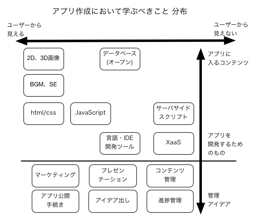

アプリを作成するための塾 シラバス
=================================

これは、いわゆる「アプリ」を作成したい！と志す方向けに、何を学んだらよいのか？
を提示するドキュメントである。

※ここでいう「アプリ」とは、主にiPhoneやAndroidデバイスなど、タブレット以下サイズ
のパーソナルなデバイスで動作させることを前提とした、もしくは、モバイルファースト
なことを前提とした、アプリケーション、サービスのことをさす。

アプリ開発では日進月歩を超えた変化が必要な世界なので、具体的なツールや
方法については、できるだけ提示しない。

例えば、ここで iOS 8 でのアプリ公開方法を提示しても、3ヶ月後には使える保証
は全くないからである。

あくまでも、アプリを作成するのに必要な技術や方法の名前を提示する。

ここに提示する技術や方法については、全てが修得必須なわけではない、あくまでも
「自分が作りたいアプリに必要なもの」だけを覚えればよいし、制作に関わる人数、
内容によっては、全く覚える必要のないものがある。

アプリ開発以外
==============

アプリを開発する以前に、開発する・したいアプリについて議論・提示する技術も必要と
なる。

### 学ぶべき技術 ###

- アイデア出し
- リリース前・後の販促マーケティング
- プレゼンテーション

アプリの提供方式
================

Webアプリ
---------

機種固有の機能に依存せず、Webブラウザーでアクセスすることで提供する方式である。

### 学ぶべき技術 ###

- html/css
- JavaScript
- サーバサイドスクリプト
- PaaS / IaaS

ネイティブアプリ
----------------

iOSやAndroidの機種固有の機能も提供できる方式である。主にマーケット経由で
ユーザーの端末にインストールしてもらう。

プッシュ通知、機種固有のUI、操作の快適性を提供できる。反面、iOS向けに作成
したものをAndroid向けにも提供する場合にはソフトウェアを2つ作成する必要が
ある。

この手間を省くために、クロスプラットフォーム、マルチプラットフォーム開発が
可能なツールも提供されている。

### 学ぶべき技術 ###

- 各プラットフォームに対応した開発言語、IDE、ツール
- 各プラットフォーム上のアプリ公開手続き

コンテンツ
==========

ユーザーに提示するUIの基本的な部分は、各プラットフォームなどが用意してくれるが、
そのアプリ固有のコンテンツは必ず必要になってくる。

データ
------

オープンデータを利用したり、オープンデータを加工して見やすくしたりする。
アプリ開発者が使える形、フォーマットというものの理解が必要。

### 学ぶべき技術 ###

- オープンデータへのアクセス方法
- データの正規化、フォーマット
- データベース(マスタ作成)

画像・映像・音声
----------------

### 学ぶべき技術 ###

- 2D及び3D画像加工・作成・編集
- BGM、SE、クリック音

進行・多人数開発
================

アプリの進行管理を行うにも様々な技術やツールが存在する。
これらは統合されて提供されていたり、連携するのが用意なものも多い。

コンテンツ・コード管理
-------------------

アプリを制作するには、コンテンツやソースコードを管理しなくてはならない。

### 学ぶべき技術 ###

- コードリポジトリー
- ファイルの共有

進捗管理・開発者情報共有
--------------------

### 学ぶべき技術 ###

- コミュニケーションツール
- チャットツール
- ToDoリスト
- バグトラッカ
- 上記を総合的なソーシャルコーディングツール

サーバ
======

ユーザーのデータをサーバに保存しておいて、利用する際には必ず必要である。

また、ネイティブアプリとしてユーザーの端末にダウンロードとインストールを行わない
形態で提供する場合にも必須である。

### 学ぶべき技術 ###

- SaaS
- PaaS
- IaaS

分布図
=====

